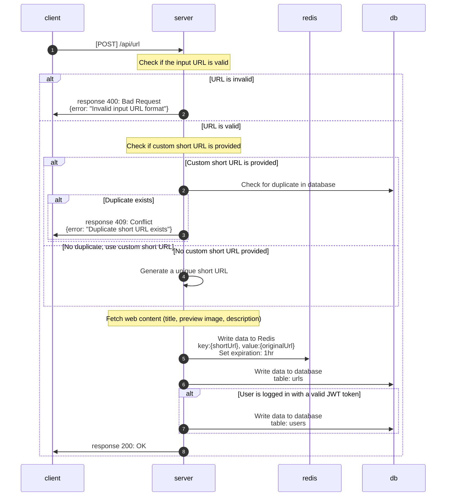

# create short url

**POST** `{domain}/api/url`

## Authorization

* JWT

## Request

Request Body

| Field  | Type   | Required | Description |
| ------ | ------ | :------: | ----------- |
| url    | string | Yes      | Original URL |
| customShortUrl    | string | No      | Custom short URL |

## Response

| Field   | Type   | Description |
| ------- | ------ | ----------- |
| originUrl  | string | Original URL |
| shortUrl    | string | Short URL |
| createTime    | string | Creation time |
| title    | string | Original URL title |
| previewImage | string | Preview image |

### Status code

* **200 OK**: Successful create the URL.
* **400 Bad Request**: Invalid input URL format.
* **409 Conflict**: Duplicate short URL exists.

## Flow

