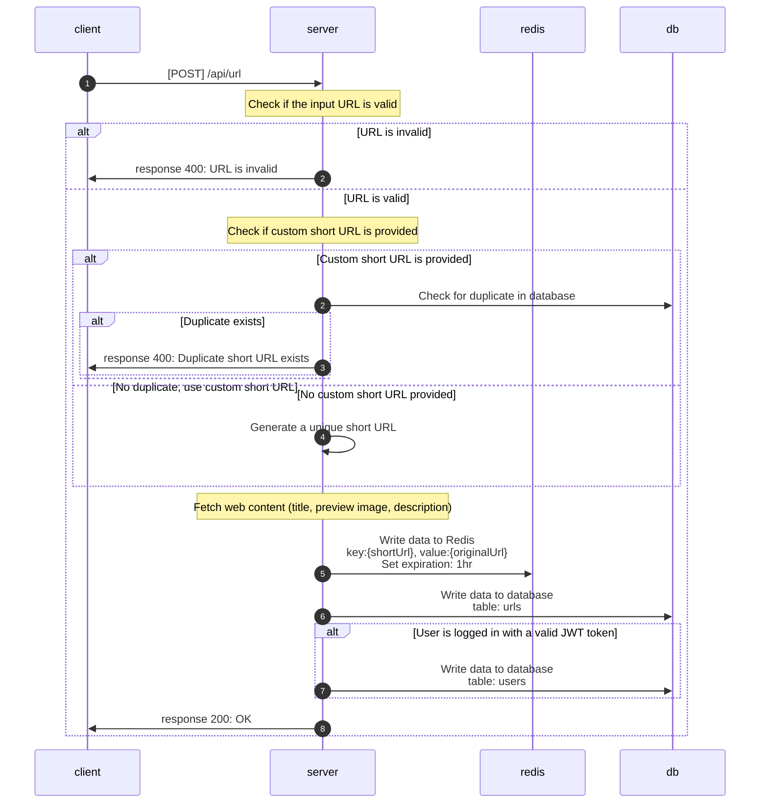

# create short url

**POST** `{domain}/api/url`

## Authorization

* JWT

## Request

Request Body

| Field  | Type   | Required | Description |
| ------ | ------ | :------: | ----------- |
| url    | string | Yes      | 原始網址 |
| customShortUrl    | string | No      | 自定義短網址 |

## Response

| Field   | Type   | Description |
| ------- | ------ | ----------- |
| originUrl  | string | 原始網址 |
| shortUrl    | string | 短網址 |
| createTime    | string | 建立時間 |
| title    | string | 原始網址標題 |
| previewImage | string | 預覽圖片 |

## Flow

