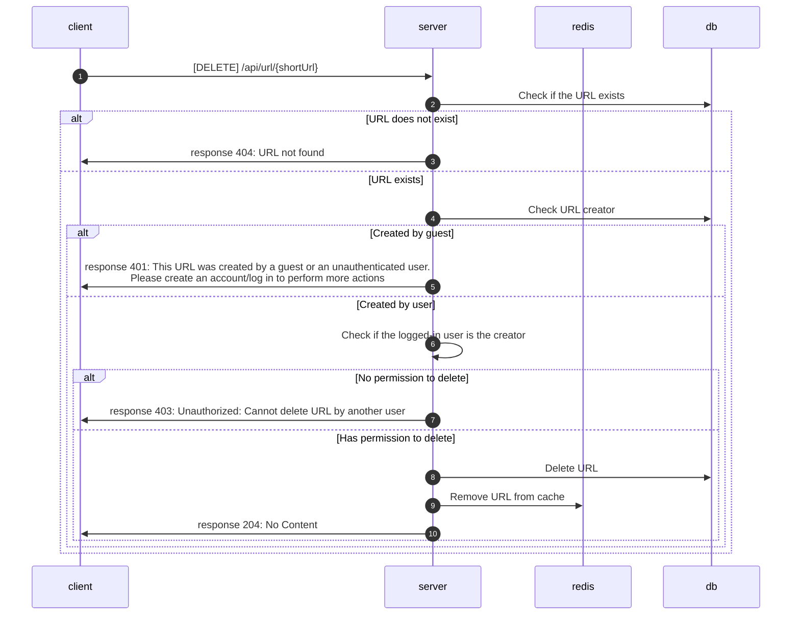

# Delete Short URL

**DELETE** `{domain}/api/url/{shortUrl}`

## Authorization

* JWT

## Request

* None

## Response

### Status code

* **204 No Content**: Successful deletion of the URL.
* **401 Unauthorized**: The URL was created by a guest or an unauthenticated user.
* **404 Not Found**: The URL does not exist.
* **403 Forbidden**: Cannot delete the URL created by another user.

## Flow

