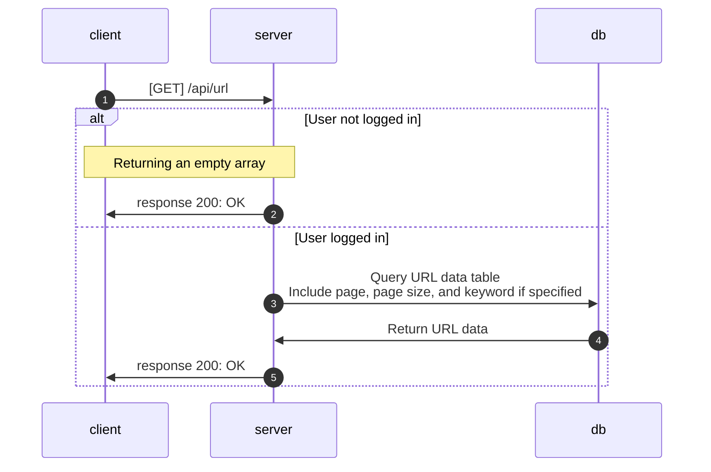

# Get Short URL List

**GET** `{domain}/api/url`

## Authorization

* JWT

## Request

| Field         | Type   | Required | Description                                 | Default |
| ------------- | ------ | :------: | ------------------------------------------- | ------- |
| page          | string |    No    | The page number to retrieve (for pagination) | 0       |
| pageSize      | string |    No    | The number of items per page (for pagination) | 1000    |
| searchKeyword | string |    No    | Keyword to search in the URL titles          |         |

## Response

* Returns an array of objects representing the URLs.

| Field      | Type             | Description               |
| ---------- | ---------------- | ------------------------- |
| content    | List of Url      | A list of URL objects     |
| pagination | PaginationData   | Pagination details        |

### Url

| Field        | Type   | Description                    |
| ------------ | ------ | ------------------------------ |
| originUrl    | string | The original URL               |
| shortUrl     | string | The shortened URL              |
| createTime   | string | The time when the URL was created |
| title        | string | The title of the original URL  |
| previewImage | string | A preview image of the URL     |

### PaginationData

| Field   | Type    | Description                  |
| ------- | ------- | ---------------------------- |
| page    | number  | The current page number      |
| size    | number  | The number of items per page |
| hasNext | boolean | Indicates if there is a next page |
| pageCount | number | The total number of pages    |

## Flow

