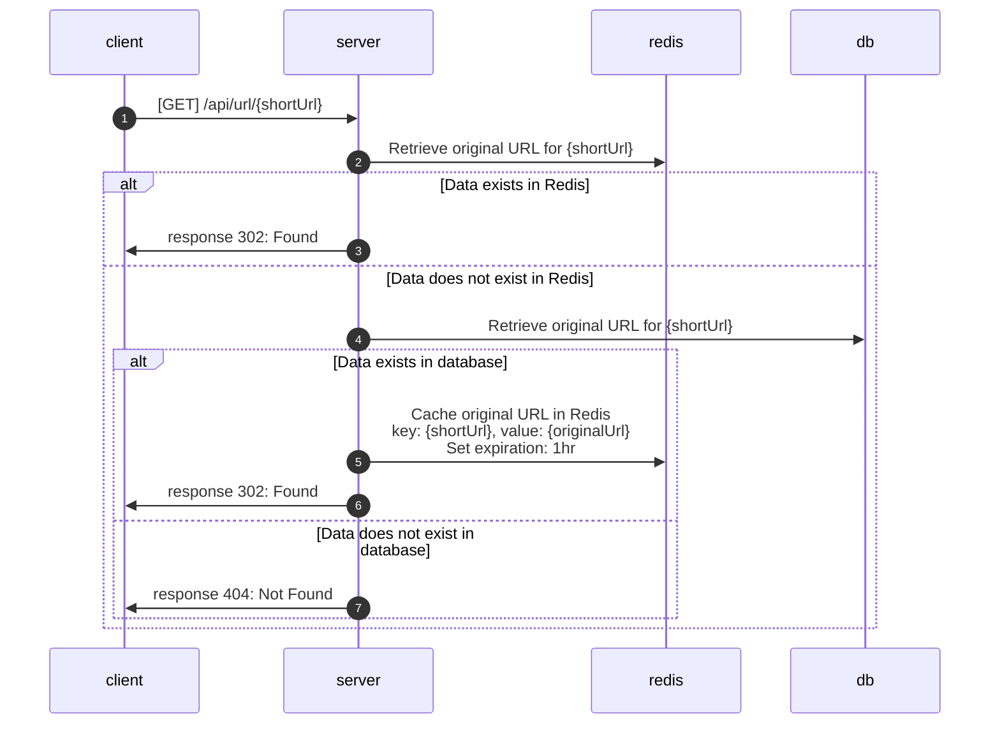

# Redirect url

**GET** `{domain}/api/url/{shortUrl}`

## Request

* None

## Response

### Status code

* **302 Found**: Redirect to the original URL.
* **404 Not Found**: The URL is not found.

## Flow

