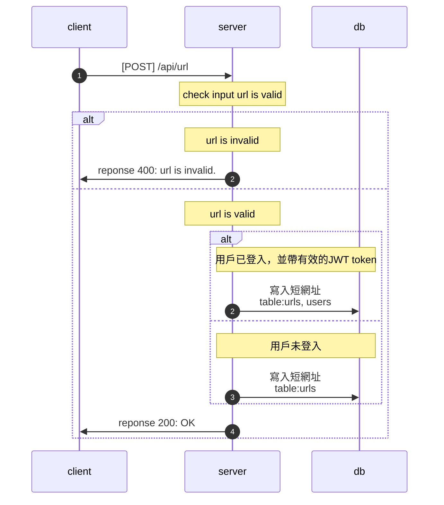
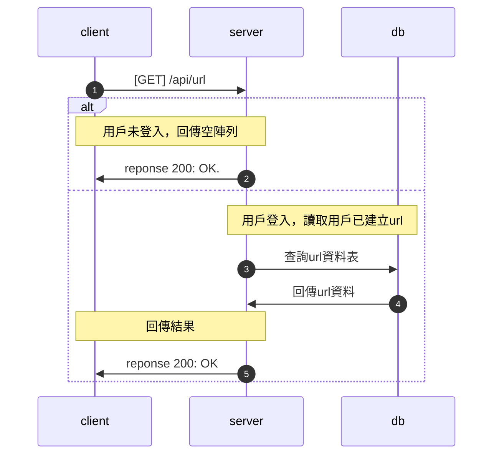
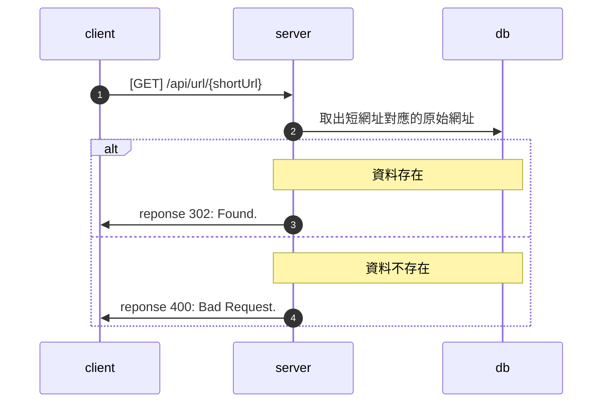

# url API

## POST /api/url

### Authorization

* JWT

### Request

Request Body

| Field  | Type   | Required | Description |
| ------ | ------ | :------: | ----------- |
| url    | string | Yes      | 原始網址 |

### Response

| Field   | Type   | Description |
| ------- | ------ | ----------- |
| originUrl  | string | 原始網址 |
| shortUrl    | string | 短網址 |

### Flow

## GET /api/url

### Authorization

* JWT

### Request

* None

### Response

* Returns an array of objects representing the URLs.

| Field   | Type   | Description |
| ------- | ------ | ----------- |
| originUrl  | string | 原始網址 |
| shortUrl    | string | 短網址 |

### Flow

## GET `/api/url/{shortUrl}`

### Request

* None

### Response

* Redirect to original url

### Flow

